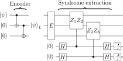

---
fonts:
  sans: "Inter, Inter Variable Text, Source Han Sans SC, Source Han Sans SC VF"
  provider: none
  fallbacks: false
---

# QEC 101

Introduction to quantum error correction

  Xiangdong Zeng
   
  November 15, 2024
  <!-- {{ new Date().toLocaleDateString("en-US", { dateStyle: "long" }) }} -->

---

## Invitation: QR code

<v-click>

- Basic idea: using **redundant** information
- Error correction level: 7--30%
- Reed--Solomon codes
  - Polynomials over finite fields (Galois fields)
- 回形针 PaperClip：[Vol.120 二维码的秘密](https://youtu.be/XW8sgT_D0To)

</v-click>

---

## Quantum errors

<v-clicks>

- Bloch sphere state: $\ket{\psi} = \cos\frac\theta2\ket{0} + e^{i\phi}\sin\frac\theta2\ket{1}$
- General coherent error: $U(\delta\theta, \delta\phi)\ket{\psi} = \cos\frac{\theta+\delta\theta}{2}\ket{0} + e^{i(\phi+\delta\phi)}\sin\frac{\theta+\delta\theta}{2}\ket{1}$
  - Rotation on Bloch sphere
- Write in Pauli matrices: $U(\delta\theta, \delta\phi) = \alpha_I I + \alpha_X X + \alpha_Z Z + \alpha_Y Y \, {\color{gray}(=\alpha_{XZ} XZ)}$
- Two types: $X$-error ($\ket{0}\leftrightarrow\ket{1}$) and $Z$-error ($\ket{0}\to\ket{0}, \ket{1}\to-\ket{1}$)
- Challenges:
  - No-cloning theorem: $U_{\text{clone}}(\ket{\psi}\otimes\ket{0}) \not\to \ket{\psi}\otimes\ket{\psi}$
  - Detect both $X$ and $Z$ errors simultaneously
  - Wavefunction collapse
  - Continuous error in $\theta$ and $\phi$
- General procedure:
  - Syndrome extraction: measure $U\ket{\psi}$ and project to subspace (e.g. $X\ket{\psi}$)
  - Apply correspoding operator (e.g. $X^{-1}$) to recover $\ket{\psi}$

</v-clicks>

---
layout: two-cols
layoutClass: gap-16
---

## Bit flip code (1)

<v-clicks>

- Initial state: $\ket{\psi} = \alpha\ket{0} + \beta\ket{1}$
- Bit flip error: $P(\ket{0} \leftrightarrow \ket{1}) = p$
- No-cloning theorem:
  - $\ket{\psi}\not\to\ket{\psi\psi\psi}$
  - $\ket{0}\to\ket{0_L}=\ket{000}, \, \ket{1}\to\ket{1_L}=\ket{111}$
    - Logical qubits: $\ket{x_L}$, ancilla qubits: $\ket{x00}$
- Syndrome diagnosis:
  - $P_0 = \ket{000}\bra{000}+\ket{111}\bra{111}$: no error
  - $P_1 = \ket{100}\bra{100}+\ket{011}\bra{011}$: bit flip on qubit 1
  - $P_2 = \ket{010}\bra{010}+\ket{101}\bra{101}$: bit flip on qubit 2
  - $P_3 = \ket{001}\bra{001}+\ket{110}\bra{110}$: bit flip on qubit 3
- Correct error: apply $M = \sum_i X_i P_i$

</v-clicks>

::right::

<v-click>

- Only single bit flip error can be corrected
- Fidelity:
  - $F_{\psi} = 1-p$
  - $F_{\psi'} = (1-p)^3 + 3p(1-p)^2 > F_{\psi}$ for $p < \frac12$

</v-click>

---
layout: two-cols
layoutClass: gap-16
---

## Bit flip code (2)

<v-clicks>

- Another way to do syndrome measurement:
  - $Z_1Z_2 = Z\otimes Z\otimes I$: compare first two qubits
  - $Z_2Z_3 = I\otimes Z\otimes Z$: compare last two qubits
- Syndrome table:
  - $\mathtt{00}$: no error
  - $\mathtt{01}$: bit flip on qubit 1
  - $\mathtt{10}$: bit flip on qubit 2
  - $\mathtt{11}$: bit flip on qubit 3
- Measurement **does not** change the state
- Sign flip code:
  - Dual between $X$ and $Z$

</v-clicks>

::right::

---

## Quantum code distance

<v-clicks>

- Classical:
  - Minimum Hamming distance between any two codewords
  - $d_{\text{classical}}(0000, \, 1111) = 4$
- Quantum:
  - Shortest path to get from one state to another by using Pauli operators
  - Minimum size error that will go undetected
- $[[n,k,d]]$ notation:
  - $n$: number of **physical** qubits
  - $k$: number of **logical** qubits
  - $d$: code distance

</v-clicks>

---

## Stabilizer formalism (1)<v-click>: we need some group theory!</v-click>

<v-clicks>

- Pauli group:
  - 1 qubit: $G_1 = \{\pm I,\pm iI,\pm X,\pm iX,\pm Y,\pm iY,\pm Z,\pm iZ\} = \langle X,Y,Z\rangle$
  - $n$ qubits: $G_n = \{g_i \otimes\cdots\otimes g_n | g_i \in G_1\}$
- Stabilizer group: all elements that leave a state invariant
  - $\mathcal{S} = \{g \in G_n | g\ket{\psi} = \ket{\psi}\}$
  - $\mathcal{S}$ is Abelian group
- Example:
  - 3 qubits, $\mathcal{S} = \{I, Z_1Z_2, Z_2Z_3, Z_3Z_1\} = \langle Z_1Z_2, Z_2Z_3\rangle$
  - $Z_1Z_2$ can stabilize $\{ \ket{000}, \ket{001}, \ket{110}, \ket{111} \}$
  - $Z_2Z_3$ can stabilize $\{ \ket{000}, \ket{100}, \ket{011}, \ket{111} \}$
  - Hence $\mathcal{S}$ can stabilize $\{ \ket{000}, \ket{111} \}$

</v-clicks>

---

## Stabilizer formalism (2)

<v-clicks depth="2">

- Error $E\in\mathcal{E}\subset G_n$, measurement $M\in\mathcal{S}$
  - $M$ and $E$ anti-commute: $M(E\ket{\psi}) = -EM\ket{\psi} = -E\ket{\psi}$
    - Error will corrupt the encoded state
    - Can detect error $E$
  - $M$ and $E$ commute: $M(E\ket{\psi}) = EM\ket{\psi} = E\ket{\psi}$
    - Can't correct error $E$
- Stabilizer error-correcting condition:
  - Any errors $E_1, E_2\in\mathcal{E}$ can be corrected, if
    - $E_1^\dagger E_2 \notin \mathcal{Z}(\mathcal{S})$ or
    - $E_1^\dagger E_2 \in \mathcal{S}$
  - Centralizer: $\mathcal{Z}(\mathcal{S}) = \{g\in G_n | gM = Mg, \forall M\in\mathcal{S}\}$
    - Commute with all elements in $\mathcal{S}$

</v-clicks>

---
layout: two-cols
layoutClass: gap-16
---

## Shor code

- 9 physical qubits for 1 logical qubit
- Combine bit flip and sign flip codes
  - $Z_1Z_2, \, Z_2Z_3, \, \ldots, \, Z_8Z_9$ will detect $X$ errors
  - $X_1X_2X_3X_4X_5X_6, \, X_4X_5X_6X_7X_8X_9$ will detect \
    $Z$ errors

<v-click>

- Stabilizer language ($[[9,1,3]]$ code):
  - $\mathcal{S} = \{Z_1Z_2, \, \ldots, \, Z_8Z_9, \, X_1\cdots X_6, \, X_4\cdots X_9\}$
  - Example:
    - $E=X_1Y_4\notin\mathcal{Z}(\mathcal{S})$: anti-commute with $Z_1Z_2$, can be corrected
    - $E=Z_1Z_3\in\mathcal{S}$: can be corrected

</v-click>

::right::

---
layout: two-cols
layoutClass: gap-16
---

## And more...

<v-clicks>

- Surface code: topological QEC
  - 2D lattice of qubits
  - Stabilizer: Pauli chains on the surface
  - Anyons, topological order, string-net condensation, \
    categorical symmetries, etc
  - See [arXiv:quant-ph/9707021](https://arxiv.org/abs/quant-ph/9707021) etc
- HaPPY code: holographic QEC
  - Encode $k$ “bulk” logical qubits into \
    $n$ “boundary” physical qubits
  - Bulk-boundary correspondence, AdS/CFT duality, \
    Ryu--Takayanagi formula, tensor networks, *p*-adic physics, etc
  - See [arXiv:1503.06237](https://arxiv.org/abs/1503.06237) and [1802.01040](https://arxiv.org/abs/1802.01040)

</v-clicks>

::right::

---

## References

- 杂然赋流形丶. [可否用通俗的物理语言（少用一点数学...）解释下量子纠错码？](<https://www.zhihu.com/question/29447951/answer/3547326663>)
- 杂然赋流形丶. [https://www.zhihu.com/question/29447951/answer/3547326663](https://zhuanlan.zhihu.com/p/706137248)
- 魏朝晖. [CCF量子计算 |07⟩ 量子纠错与量子电路（上）](https://www.bilibili.com/video/BV1u54y1g7mB)
- 魏朝晖. [CCF量子计算 |08⟩ 量子纠错与量子电路（下）](https://www.bilibili.com/video/BV1Q84y1K7uq)
- Wikipedia. [*Quantum error correction*](https://en.wikipedia.org/wiki/Quantum_error_correction)
- Wikipedia. [*Stabilizer code*](https://en.wikipedia.org/wiki/Stabilizer_code)
- J. Roffe. *Quantum Error Correction: An Introductory Guide* ([arXiv:1907.11157](https://arxiv.org/abs/1907.11157))
