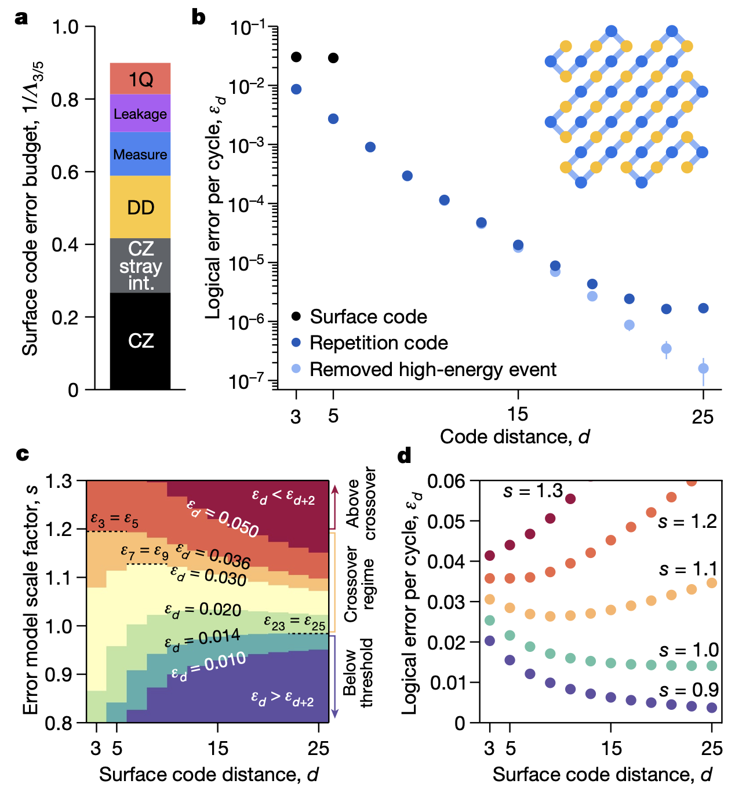

# Introduction to Willow

The newest generation of superconducting processors from Google Quantum AI

  Xiangdong Zeng
   
  January 8, 2025

---
layout: image
image: ./images/google-quantum-roadmap.png
---

---

## Sycamore (72 qubits, 2022)

  
  

---

## Willow (105 qubits, 2024)

  
  

---

## Zuchongzhi 3.0 (105 qubits, 2024)

  
  

---

## Surface code circuits

<figure class="text-center mb-4">
  
  <figcaption class="text-sm opacity-50">A stabilizer measurement. MR: measure and reset, DD: dynamical decouple</figcaption>
</figure>

- Prepare **data qubits** in a product state in either the $X_L$ or $Z_L$ basis of the ZXXZ surface code
- **Measure qubits** extract parity information from the data qubits to be sent to the **decoder**
- Repeat a variable number of cycles of error correction
- Run **data qubit leakage removal (DQLR)** to ensure that leakage is short-lived
  - Add special SWAP gates
  - See [Overcoming leakage in quantum error correction](https://www.nature.com/articles/s41567-023-02226-w). *Nature Physics* **19**, 1780--1786 (2023)
- Measure the state of the **logical qubit** by checking decoder's outcome

---
layout: two-cols
layoutClass: gap-16
---

## Threshold

- In principle, as physical error rates decrease, the logical error rate of a larger code should improve faster than a smaller code
  - See [3-logical-errors.ipynb](https://github.com/qlang-qec/qec/blob/main/3-logical-errors.ipynb)
- But leakage accumulation etc. may cause larger code performance to degrade faster
- Logical error rate: $\varepsilon_d \propto \left( \frac{p}{p_\text{thr}} \right)^{(d+1)/2}$
  - $p$: physical error rate
  - $p_\text{thr}$: threshold error rate
- Error suppression factor: $\Lambda = \frac{\varepsilon_d}{\varepsilon_{d+2}}$

::right::

  <figure v-click.hide="1" class="absolute flex flex-col justify-center items-center h-full">
    
    <figcaption class="text-sm opacity-50">Sycamore (72 qubits)</figcaption>
  </figure>
  <figure v-click="1" class="absolute flex flex-col justify-center items-center h-full">
    
    <figcaption class="text-sm opacity-50">Willow (105 qubits)</figcaption>
  </figure>

---

## Error budget

|     Component     | $p_\text{expt}^{(i)}$ | $w_i$ | $1/\Lambda$ contrib. |
| :---------------: | :-------------------: | :---: | :------------------: |
|     CZ gates      | $2.8 \times 10^{-3}$  |  65   |     0.182 (41%)      |
|   CZ crosstalk    | $5.5 \times 10^{-4}$  |  91   |      0.05 (11%)      |
|    CZ leakage     | $2.0 \times 10^{-4}$  |  108  |      0.022 (5%)      |
|  Data qubit idle  | $0.9 \times 10^{-2}$  |  10   |      0.09 (20%)      |
|      Readout      | $0.8 \times 10^{-2}$  |   6   |     0.048 (11%)      |
|       Reset       | $1.5 \times 10^{-3}$  |   6   |      0.009 (2%)      |
|     SQ gates      | $6.2 \times 10^{-4}$  |  63   |      0.039 (9%)      |
| Leakage (heating) | $2.5 \times 10^{-4}$  |  18   |      0.005 (1%)      |

<!--
- 退相干，通过衰减 ($T_1$)、纯去相干 ($T_\phi$) 以及量子比特被动加热至状态 $\ket{2}$ 量化
- 读取和复位错误
- 由退相干引起的高频量子比特泄漏，发生在 CZ 门操作期间，表现为从状态 $\ket{11}$ 到 $\ket{02}$ 的转变
- 在并行 CZ 操作期间，最近邻或对角近邻量子比特之间的杂散耦合串扰
- 单比特门和 CZ 门上的溢出错误（未被前述来源考虑），以及在测量和复位期间数据比特空闲时的错误
- 通过更高激发跃迁（例如，$\ket{12}\to\ket{30}$）在 CZ 门比特之间传递泄漏
-->

---
layout: two-cols
layoutClass: gap-16
---

## Real-time decoding (1)

- Streaming decoding algorithm
  - Subdivided into blocks, with different threads responsible for different blocks
- Sparse Blossom algorithm
  - Resolve local configurations of errors, using a parallelization strategy
- Real-time vs offline
  - Performance metrics: accuracy, latency and throughput
  - Average latency: 63±17 µs
  - Real-time decoder vs neural network: \
    20 times faster

::right::

---
layout: two-cols
layoutClass: gap-8
---

## Real-time decoding (2)

- List of decoders:
  - [Neural network decoder](https://arxiv.org/abs/2310.05900)
  - [Matching synthesis decoder *Libra*](https://arxiv.org/abs/2408.12135)
  - [Ensembled matching decoder *Harmony*](https://arxiv.org/abs/2401.12434)
  - [Correlated matching decoder](https://arxiv.org/abs/1310.0863)
  - [Real-time decoder](https://arxiv.org/abs/2205.09828)
  - Beliefmatching, BP+OSD, and tensor network decoders, etc.

::right::

<!--
- (B) 递归网络随时间迭代，更新解码器状态的表示，并在每个循环中加入新的稳定子。
- (C) 为每个新稳定子创建嵌入向量 S_{ni} 。
- (D) 递归网络的每个模块将解码器状态与一个循环的稳定子 S_n 结合（缩小到0.7倍）。解码器状态通过三个综合变换器层进行更新。
- (E) 每个综合变换器层通过多头注意力（由学习到的注意力偏差调制）更新稳定子表示，随后是一个稠密块和扩张的二维卷积。
- (F) 从最终的解码器状态预测逻辑错误。
-->

---

## References

- Google Quantum AI and Collaborators. [Quantum error correction below the surface code threshold](https://www.nature.com/articles/s41586-024-08449-y). *Nature* (2024).
- Google Quantum AI. [Suppressing quantum errors by scaling a surface code logical qubit](https://www.nature.com/articles/s41586-022-05434-1). *Nature* 614, 676--681 (2023).
- Google Quantum AI. [Exponential suppression of bit or phase errors with cyclic error correction](https://www.nature.com/articles/s41586-021-03588-y). *Nature* 595, 383--387 (2021).
- USTC Quantum Group and Collaborators. [Establishing a New Benchmark in Quantum Computational Advantage with 105-qubit *Zuchongzhi* 3.0 Processor](https://arxiv.org/abs/2412.11924), arXiv:2412.11924 (2024)
- [Google Quantum AI](https://quantumai.google)
