---
fonts:
  sans: "Inter, Inter Variable Text"
  provider: none
  fallbacks: false
---

# Topological Quantum Computing

  Xiangdong Zeng
   
  June 25, 2025

---
layout: two-cols
layoutClass: gap-16
---

## Anyons

- 3D case
  - Paths are topologically equivalent: \
    $\ket{\Psi(\lambda_2)} = \ket{\Psi(\lambda_1)} = \ket{\Psi(0)}$
  - Encircle = exchange²: $\ket{\Psi(\lambda_2)} = R^2 \ket{\Psi(0)}$
  - $R = \pm1$: bosons and fermions

<v-click>

- 2D case
  - No longer topologically trivial: \
    $\ket{\Psi(\lambda_2)} \neq \ket{\Psi(\lambda_1)} = \ket{\Psi(0)}$
  - $R = \mathrm{e}^{i\theta}$: abelian anyons
  - $R$ is a unitary matrix: non-abelian anyons

</v-click>

::right::

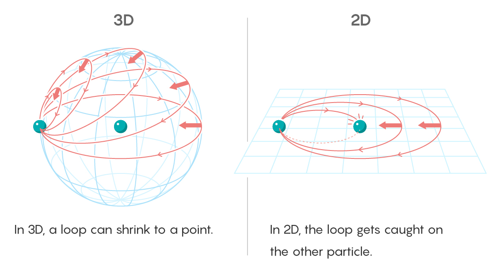

---

## Topological states

- Symmetry-protected topological (SPT) states
  - Topological only given that some protecting symmetry
  - Do not support anyons as intrinsic quasiparticle excitations, unless ...
  - Having **defects**
    - Majorana zero modes
  - Examples: integer quantum Hall states, topological insulators

<v-click>

- (Intrinsic) topological order
  - Exhibit **long-range entanglement**
  - Give rise to **ground state degeneracy** and **topological entanglement entropy**
  - Examples: fractional quantum Hall states, spin liquids

</v-click>

---
layout: two-cols
layoutClass: gap-16
---

## Anyon models: fusion and braiding

- Anyons can be
  - Created or annihilated in pairwise fashion
  - **Fused** to form other types of anyons
  - **Exchanged** adiabatically

<v-click>

- Fusion rules: $a \otimes b = \sum_{c\in M} N_{ab}^c c$
  - $M = {\mathbf{1}, a, b, c, \dots}$ is the set of anyons
  - $N_{ab}^c = 0, 1, \dots$ is the fusion coefficient

</v-click>
<v-click>

- Vector space
  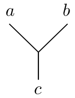 $\in\mathbb{V}^{ab}_c$:
  $a$ and $b$ fuse to $c$

</v-click>

::right::

<v-click>

- *F*-move: basis transformation in $\mathbb{V}^{abc}_d$

  

    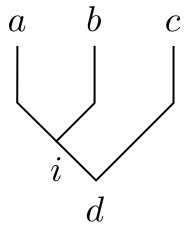 $= \sum_{j} [F^{abc}_d]_{ij}$ 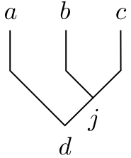

  

</v-click>
<v-click>

- *R*-move: exchanging two anyons

  

    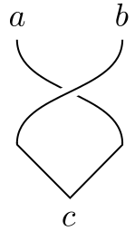 ${}=R^{ab}_c$ 

  

</v-click>

---

## Anyon models: consistency relation

  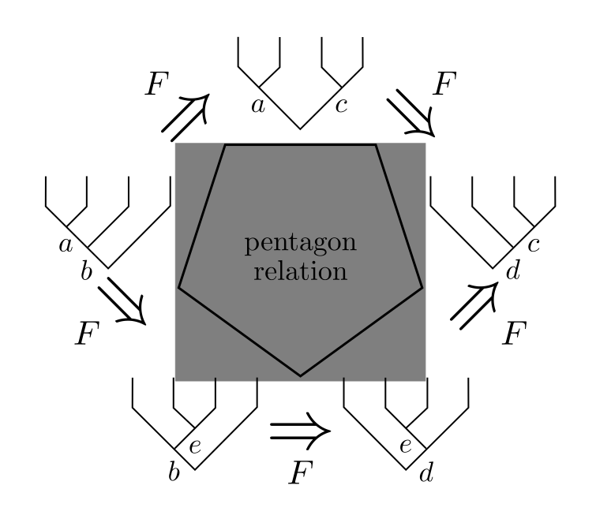
  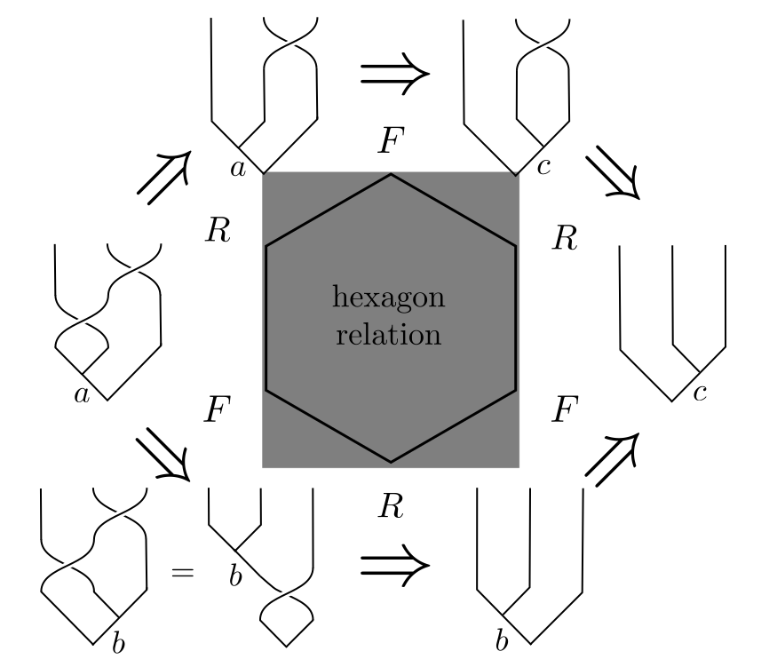

---
layout: two-cols
layoutClass: gap-16
---

## Mathematical structure (1)

- A **monoidal (tensor) category** is a category $\mathcal{C}$ with:
  - Tensor product: a bi-functor $\otimes \colon \mathcal{C} \times \mathcal{C} \to \mathcal{C}$
  - Unit object: $\mathbf{1} \in \mathcal{C}$
  - Natural isomorphisms:
    - Associator: $\alpha_{x,y,z} \colon (x \otimes y) \otimes z \overset\sim\to x \otimes (y \otimes z)$
    - Left unitor: $\lambda_x \colon \mathbf{1} \otimes x \overset\sim\to x$
    - Right unitor: $\rho_x \colon x \otimes \mathbf{1} \overset\sim\to x$
  - The following two diagrams commute

<v-click>

- MacLane's coherence theorem:
  - Every monoidal category is equivalent to a strict one
  - “$\overset\sim\to$” becomes “$=$”

</v-click>

::right::

  <figure class="text-center">
    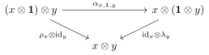
    <figcaption class="text-sm opacity-50">Triangle equation</figcaption>
  </figure>
  <figure class="text-center">
    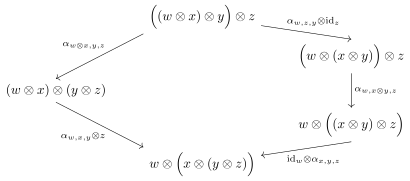
    <figcaption class="text-sm opacity-50">Pentagon equation</figcaption>
  </figure>

---
layout: two-cols
layoutClass: gap-16
---

## Mathematical structure (2)

- A **braided monoidal category** is a monoidal category $\mathcal{C}$ with:
  - Braiding: $\sigma_{x,y} \colon x \otimes y \overset\sim\to y \otimes x$
  - The following two diagrams commute

<v-click>

- A **fusion category** is
  - A (rigid semisimple $\mathbb{C}$-linear) monoidal category
  - With finitely many simple objects and \
    finite dimensional spaces of morphisms
  - Unit object $\mathbf{1}$ is simple

</v-click>
<v-click>

- A **modular tensor category** is
  - A braided monoidal fusion category
  - With $S$ matrix $s_{ij} =$ 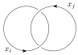 non-degenerate

</v-click>

::right::

<figure class="text-center mt-32">
  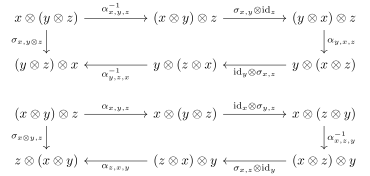
  <figcaption class="text-sm opacity-50">Hexagon equations</figcaption>
</figure>

---

## Examples

- **Fibonacci** anyon model
- Anyons: $\mathbf{1}, \, \tau$
- Fusion rules: $\tau \otimes \tau = \mathbf{1} + \tau$

<v-click>

- Why Fibonacci?
  - $\tau\otimes\tau\otimes\tau = \mathbf{1} + 2\cdot\tau,$ \
    $\tau\otimes\tau\otimes\tau\otimes\tau = 2\cdot\mathbf{1} + 3\cdot\tau,$ \
    $\tau\otimes\tau\otimes\tau\otimes\tau\otimes\tau = 3\cdot\mathbf{1} + 5\cdot\tau \cdots$

</v-click>
<v-click>

- *F*-matrix (basis transformation):
  - $F = F^\tau_{\tau\tau\tau} = \begin{pmatrix} \phi^{-1} & \phi^{-1/2} \\ \phi^{-1/2} & -\phi^{-1} \end{pmatrix} \rule{0ex}{4ex}$, where $\phi = \frac{1+\sqrt{5}}{2}$
- *R*-matrix (braiding):
  - $R = \begin{pmatrix} R^1_{\tau\tau} & 0 \\ 0 & R^\tau_{\tau\tau} \end{pmatrix} = \begin{pmatrix} e^{4\pi i/5} & 0 \\ 0 & e^{-3\pi i/5} \end{pmatrix} \rule{0ex}{4ex}$

</v-click>

- **Ising** anyon model
- Anyons: $\mathbf{1}, \, \psi, \, \sigma$
- Fusion rules:
  - $\psi\otimes\psi = \mathbf{1} + \sigma,$ \
    $\psi\otimes\sigma = \sigma\otimes\psi = \sigma,$ \
    $\sigma\otimes\sigma = \mathbf{1} + \psi$
  - Same as Ising CFT
- *F*-matrix:
  - $F = F^\sigma_{\sigma\sigma\sigma} = \frac{1}{\sqrt2} \begin{pmatrix} 1 & 1 \\ 1 & -1 \end{pmatrix}$
- *R*-matrix:
  - $R = \begin{pmatrix} R^1_{\sigma\sigma} & 0 \\ 0 & R^\psi_{\sigma\sigma} \end{pmatrix} = e^{-\pi i/8} \begin{pmatrix} 1 & 0 \\ 0 & e^{\pi i/2} \end{pmatrix}$

---
layout: two-cols
layoutClass: gap-16
---

## Quantum computation with anyons (1)

- Advantages:
  - Protect against local perturbations
  - Gates are free from control errors since they \
    depend only on topological characteristics

<v-click>

- Qubits: basis in fusion space
  - $\ket{00} = \ket{\sigma\sigma; \mathbf{1}} \, \ket{\sigma\sigma; \mathbf{1}} \, \ket{\sigma\sigma; \mathbf{1}}$
  - $\ket{01} = \ket{\sigma\sigma; \mathbf{1}} \, \ket{\sigma\sigma; \psi}       \, \ket{\sigma\sigma; \psi}$
  - $\ket{10} = \ket{\sigma\sigma; \psi}       \, \ket{\sigma\sigma; \psi}       \, \ket{\sigma\sigma; \mathbf{1}}$
  - $\ket{11} = \ket{\sigma\sigma; \psi}       \, \ket{\sigma\sigma; \mathbf{1}} \, \ket{\sigma\sigma; \psi}$

</v-click>
<v-click>

- Measurements: fusion outcomes
  - Detecting energy difference between $\mathbf{1}$ (vacuum) and $\psi$ (a massive particle)

</v-click>

::right::

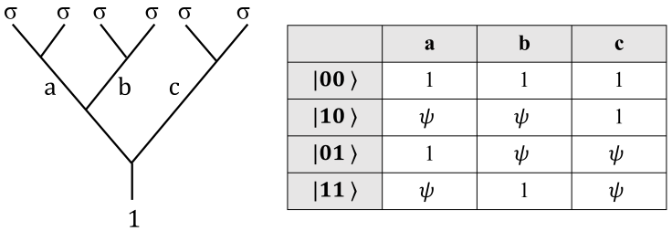

---
layout: two-cols
layoutClass: gap-16
---

## Quantum computation with anyons (2)

- Gates: braiding
- Single-qubit gates:
  - $X_1 = (R_{23})^2 = F^{-1}R^2F \otimes \mathbb{I}$
  - $Z_1 = (R_{12})^2 = R^2 \otimes \mathbb{I}$
  - $U_{H,1} = R_{12} R_{23} R_{12} = RF^{-1}RFR \otimes \mathbb{I}$
  - $R_{ij}$: exchange of anyons $i$ and $j$
- Two-qubit gate:
  - $U_{CZ} = (R_{12})^{-1} R_{34} (R_{56})^{-1}$

<v-click>

- Non-Clifford gate (necessary for universality):
  - $U = \begin{pmatrix} 1 & 0 \\ 0 & e^{i\Delta Et} \end{pmatrix}$
  - Lift the degeneracy of the fusion channels by $\Delta E$ \
    so it's not topologically protected

</v-click>

::right::

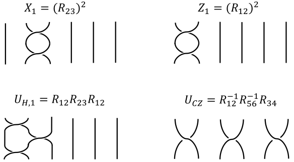

---
layout: two-cols
layoutClass: gap-16
---

## Majorana zero modes: Majorana fermions

- Creation and annihilation operators:
  - Bosons: $[b, b^\dagger] = bb^\dagger - b^\dagger b = 1$
  - Fermions: $\{f, f^\dagger\} = ff^\dagger + f^\dagger f = 1$
  - Canonical quantization → quantum field theory

<v-click>

- Rewrite as:
  - $f = \frac12 (\gamma_1 + i\gamma_2) \implies \gamma_1 = f + f^\dagger, \, \gamma_2 = i(f - f^\dagger)$
  - $\gamma_i = \gamma_i^\dagger, \, \{\gamma_i, \gamma_j\} = 2\delta_{ij}, \, \gamma_i^2 = 1$

</v-click>
<v-click>

- Majorana Fermion is its own anti-particle
  - Neutrino?

</v-click>

::right::

<figure class="flex flex-col items-center gap-4 mt-16" v-click="1">
  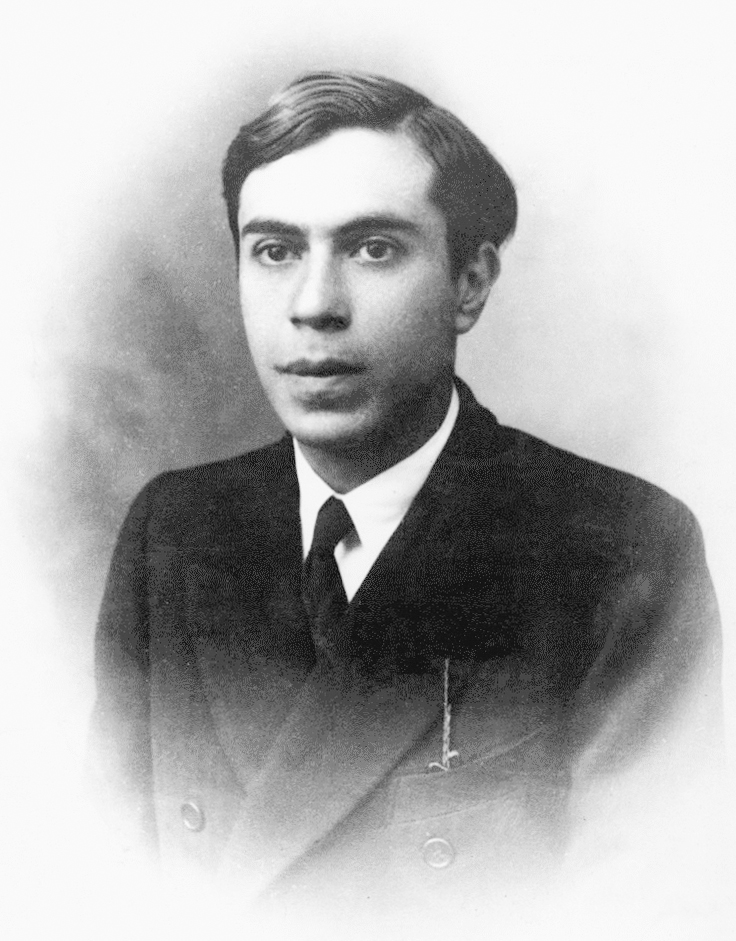
  <figcaption class="text-sm opacity-50">Ettore Majorana</figcaption>
</figure>

---

## Majorana zero modes: Kitaev chain (1)

<figure class="flex justify-center mb-4">
  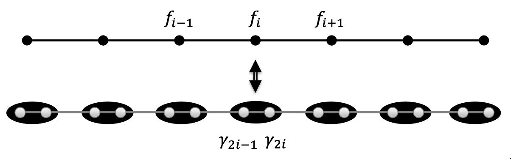
</figure>

- Hamiltonian:
  $
    \displaystyle
    H = \sum_{j=1}^L \left[ -t (f_j^\dagger f_{j+1} + f_{j+1}^\dagger f_j) - \mu \left( f_j^\dagger f_j - \frac12 \right) + \Bigl( \Delta_p f_j f_{j+1} + \Delta_p^* f_{j+1}^\dagger f_j^\dagger \Bigr) \right]
  $
  - $t$: tunnelling amplitude, $\mu$: chemical potential, $\Delta_p = |\Delta_p| e^{i\theta}$: superconducting pairing potential
  - Global symmetry: fermion parity $\mathcal{P} = \exp(i\pi \sum_j f_j^\dagger f_j)$

<v-click>

- Use Majorana operators:
  $
    \displaystyle
    H = \sum_{j=1}^L \frac i2 \left[ -\mu\gamma_{2j-1}\gamma_{2j} + \Bigl( t+|\Delta_p| \Bigr) \gamma_{2j}\gamma_{2j+1} + \Bigl( -t+|\Delta_p| \Bigr) \gamma_{2j-1}\gamma_{2j+2} \right]
  $
  - Nearest and third-nearest neighbor interaction

</v-click>

---
layout: two-cols
layoutClass: gap-16
---

## Majorana zero modes: Kitaev chain (2)

- Chemical potential term dominates: $\mu \gg t, \, |\Delta_p|$
  - $\displaystyle H = -\frac{i\mu}{2} \sum_{j=1}^L \gamma_{2j-1}\gamma_{2j}$
  - Product state, (topologically) trivial phase

<v-click>

- Kinetic/pairing term dominates: $t = |\Delta_p| \gg \mu$
  - $\displaystyle H = it \sum_{j=1}^L \gamma_{2j}\gamma_{2j+1} = 2t \sum_{j=1}^{L-1} \left( \tilde{f}_j^\dagger \tilde{f}_j - \frac12 \right)$
  - Missing fermion: $d = e^{-i\theta/2}(\gamma_1 + i\gamma_{2L})/2$
    - $\gamma_1$ and $\gamma_{2L}$: Majorana zero modes
    - $[d^\dagger d, \, H] = 0$: two-fold degeneracy
  - **Topological** phase

</v-click>
<v-click>

- Domain wall separating the phases also binds a localized Majorana mode

</v-click>

::right::

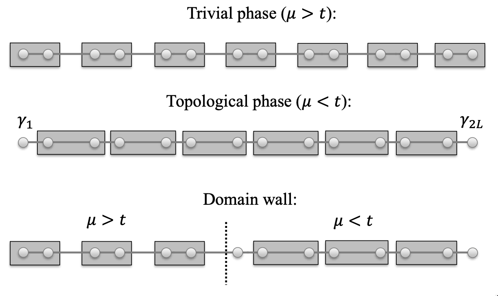

---
layout: two-cols
layoutClass: gap-16
---

## Majorana zero modes: qubits

- Anyons:
  - $\mathbf{1}$: vacuum
  - $\sigma$: Majorana zero mode $\gamma_1, \gamma_{2L}$
  - $\psi$: fermionic excitation $\tilde{f}_j^\dagger$

<v-click>

- Fusion rules:
  - $d^\dagger d = (1 + i\gamma_1\gamma_{2L})/2$: occupied or not
  - $\sigma \otimes \sigma \to \mathbf{1} + \psi$: eigenvalue 0 or 1
- Fusion channel states:
  - $i\gamma_1\gamma_{2L} \ket{\sigma\sigma; \mathbf{1}} = -\ket{\sigma\sigma; \mathbf{1}}, \, i\gamma_1\gamma_{2L} \ket{\sigma\sigma; \psi} = +\ket{\sigma\sigma; \psi}$

</v-click>
<v-click>

- Qubits:
  - Different $\psi$-parity sectors: two Kitaev chains are required
  - $\ket{0} = \ket{\sigma\sigma; \mathbf{1}} \, \ket{\sigma\sigma; \mathbf{1}}, \, \ket{1} = \ket{\sigma\sigma; \psi} \, \ket{\sigma\sigma; \psi}$

</v-click>
<v-click>

- Braiding: T-junction

</v-click>

::right::

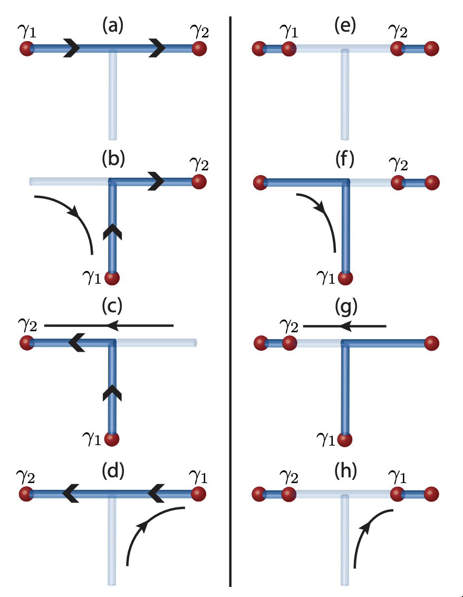

---

## The paradigm of topological order

<figure class="flex flex-col items-center gap-6 mt-8">
  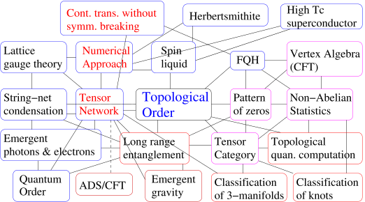
  <figcaption class="text-sm opacity-50">From Xiao-Gang Wen (arXiv:0903.1069)</figcaption>
</figure>

---

## References

- Ville Lahtinen, Jiannis K. Pachos. *A short introduction to topological quantum computation* ([arXiv:1705.04103](https://arxiv.org/abs/1705.04103))
- Bernard Field, Tapio Simula. *Introduction to topological quantum computation with non-Abelian anyons* ([arXiv:1802.06176](https://arxiv.org/abs/1802.06176))
- A. Yu. Kitaev. *Fault-tolerant quantum computation by anyons* ([arXiv:quant-ph/9707021](https://arxiv.org/abs/quant-ph/9707021))
- Michael H. Freedman, Alexei Kitaev, Michael J. Larsen, Zhenghan Wang. *Topological quantum computation* ([arXiv:quant-ph/0101025](https://arxiv.org/abs/quant-ph/0101025))
- Zhenghan Wang. *Topological quantum computation*
- B. Bakalov, A. Kirillov. *Lectures on Tensor Categories and Modular Functor*
- Guoyi Zhu, Ruirui Wang, Guangming Zhang. *Majorana fermions and topological quantum computation*
- Xin Wan, Zhenghan Wang, Kun Yang. *From the fractional quantum Hall effect to topological quantum computation*

