# Introduction to Tensor Networks

  Xiangdong Zeng
   
  Jan 19, 2026

---

## What is a tensor?

- Most general definition:
  - Tensor describes the structure that you can put two or more objects together, \
    such that some certain **coherence conditions** can be satisfied
  - [Monoidal category](https://en.wikipedia.org/wiki/Monoidal_category)
- Linear algebra aspect:
  - A **multilinear map** over some linear spaces
  - A **multi-dimensional array** when we select a set of basis (defined by components)
- Terminologies:
  - **Rank** (or degree/order): dimension of the components array
  - **Dimension**: size of each component

---

## Notations

- Abstract index notation: use components to represent the tensor itself
  - Vector: $\bm{V} = \sum_{i=1}^D V_i \, \bm{e}_i \eqqcolon V_i$
  - Matrix: $\bm{M} = \sum_{i,j=1}^D M_{ij} \, \bm{e}_i\otimes\bm{e}_j \eqqcolon M_{ij}$
  - Rank-3 tensor: $\bm{T} = \sum_{i,j,k=1}^D T_{ijk} \, \bm{e}_i\otimes\bm{e}_j\otimes\bm{e}_k \eqqcolon T_{ijk}$
  - $\otimes$: **tensor product**, $\bm{e}_i$: bases
- Diagram notation:
  - Use solid shapes (“balls”) for tensors, bonds (“legs”) for indices
  - Examples: 

---
layout: two-cols
layoutClass: gap-16
---

## Tensor contraction

- Generalization of inner product and matrix product
- Computational cost is dependent on the contraction ordering
- Examples:
  - $C_{abc} = \sum_k A_{abk} B_{kc} \eqqcolon A_{ab{\color{#b91c1c}k}} B_{ {\color{#b91c1c}k}c}$
  - $C_{abc} = \sum_{ij} A_{abij} B_{ijc} \eqqcolon A_{ab{\color{#b91c1c}ij}} B_{ {\color{#b91c1c}ij}c}$
- Use **Einstein notation** to simplify the expressions:
  - Omit the summation symbol
  - Sum over repeated indices
- Trace:
  - All the indices of a tensor are contracted
  - $\operatorname{tr}(\bm{M}) = \sum_i M_{ii} \eqqcolon M_{ii}$
  - $\bm{AB} \neq \bm{BA}$ in general, but $\operatorname{tr}(\bm{AB}) = \operatorname{tr}(\bm{BA})$

::right::

  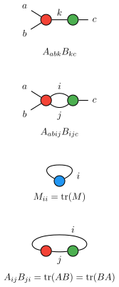
  

---

## Singular value decomposition (SVD)

- $\bm{M} = \bm{U \Sigma V}^\dagger$, where $\bm{U}$ and $\bm{V}$ are unitary, $\bm{\Sigma}$ is diagonal
- Truncated SVD: only keep first $r$ singular values in $\bm{\Sigma}$
  - Eckart--Young--Mirsky theorem: gives best rank-$r$ approximation of $\bm{M}$
  - Moore--Penrose (pseudo)inverse: $\bm{M}^+ = \bm{V \Sigma}^+ \bm{U}^\dagger$
- Split a single node into two nodes

  <figure class="flex flex-col gap-2 items-center w-60">
    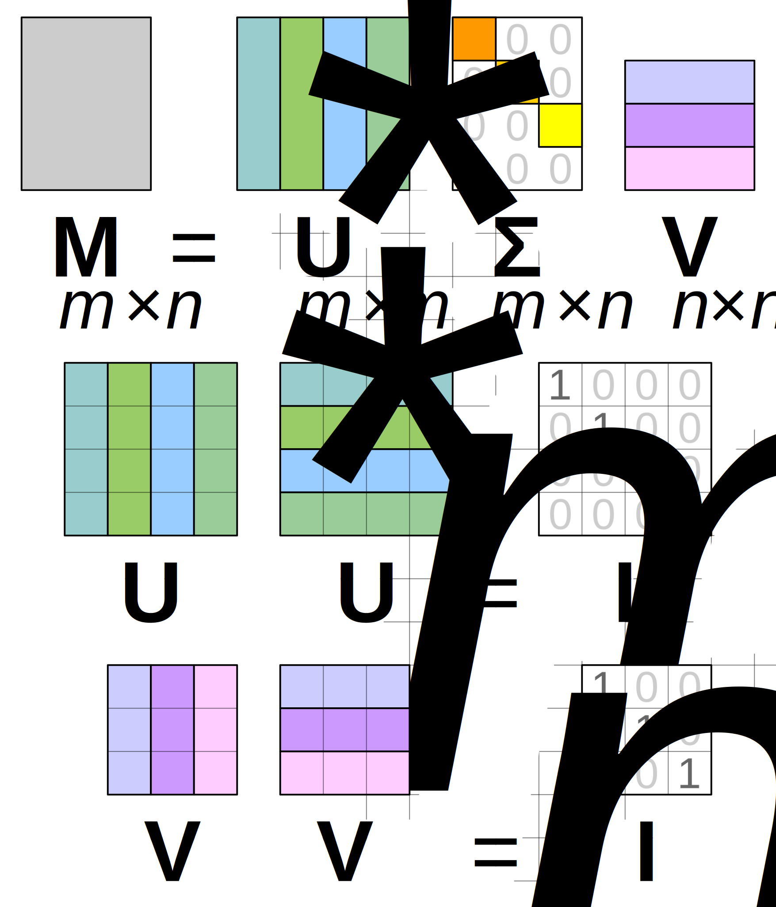
    <figcaption class="text-center">
      <a href="https://en.wikipedia.org/wiki/Singular_value_decomposition">https://en.wikipedia.org/wiki/Singular_<wbr>value_decomposition</a>
    </figcaption>
  </figure>
  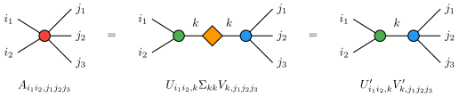

---
layout: two-cols
layoutClass: gap-16
---

## Tensor network

- A network of tensor units (no magic)
- But why?
  - Time/space complexity **increases exponentially** \
    with the size of system (i.e. Hilbert space is too large)
  - Most of the data are irrelevant and can be truncated \
    (most interactions are **local**)
    - **Area-law**: entanglement entropy scales as the area \
      of the space rather than the volume ($S \sim \partial A$)
    - Tensor network states can naturally reveal such properties
    - The same idea can be found in image/video compression

::right::

<figure class="flex flex-col gap-2 items-center translate-x-10 translate-y-30">
  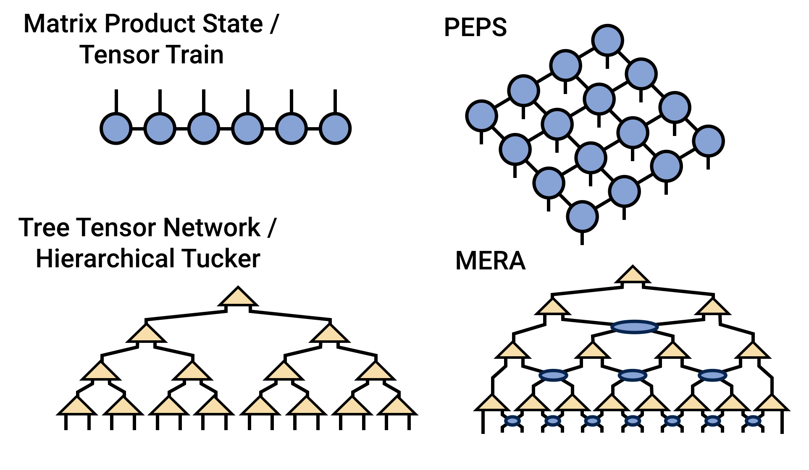
  <figcaption class="text-center">
    <a href="https://tensornetwork.org">https://tensornetwork.org</a>
  </figcaption>
</figure>

---
layout: two-cols
layoutClass: gap-16
---

## TN algorithms: MPS

- Matrix product state (MPS): 1D tensor chain
  - $\Psi_{i_1 i_2 \ldots i_n} = A^{j_1 j_2}_{i_1} \otimes A^{j_2 j_3}_{i_2} \otimes \cdots \otimes A^{j_n j_1}_{i_n}$
  - Physical indices: uncontracted legs ($i_k$)
  - Virtual indices: contracted legs ($j_k$)
- Entanglement entropy
  - $S_L = -\operatorname{tr}(\rho_L \log \rho_L) \sim \mathcal{O}(\log\chi)$
  - $\chi$: bond dimension (dimension of virtual bonds)
  - Area-law for **1D gapped Hamiltonian**
- Gauge freedom
  - Canonical form
  - Schmidt decomposition for virtual bonds (SVD)

::right::

<figure class="flex flex-col gap-2 items-center mt-24">
  
  <figcaption class="text-center mt-2 mb-16">
    MPS with open/periodic boundary conditions
  </figcaption>
  
  <figcaption class="text-center">
    Gauge freedom in MPS
  </figcaption>
</figure>

---
layout: two-cols
layoutClass: gap-16
---

## TN algorithms: DMRG

- Density matrix renormalization group (DMRG)
  - Variational optimization of MPS to find ground state
  - Ground state: $\ket{\Psi_0} = \argmin_{\ket{\Psi}} \braket{\Psi|H|\Psi} / \braket{\Psi|\Psi}$
  - Sweep through the chain, optimize two sites at a time
- Step 1: energy functional minimization:
  - $\mathcal{L} = \braket{\Psi(A)|H|\Psi(A)} - \lambda\braket{\Psi(A)|\Psi(A)}$
  - $\lambda$: Lagrange multiplier
  - Minimal condition: $\partial\mathcal{L}/\partial A = 0 \implies H_{\text{eff}} A = \lambda A$
    - Partial derivative equivalent to digging a $\tilde{A}$ hole
    - Requires canonical form of MPS
- Step 2: update MPS tensors
  - Using a truncated SVD

::right::

<figure class="flex flex-col gap-2 items-center mt-16">
  
  <figcaption class="text-center mb-8">
    Effective Hamiltonian in DMRG
  </figcaption>
  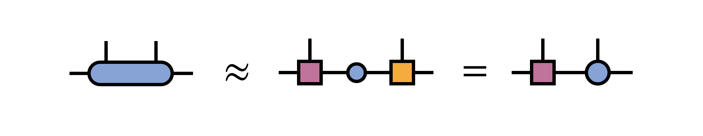
  <figcaption class="text-center">
    Truncated SVD
  </figcaption>
</figure>

---
layout: two-cols
layoutClass: gap-16
---

## TN algorithms: TEBD

- Time-evolving block decimation (TEBD)
  - Simulate time evolution: $\ket{\Psi_t} = e^{-iHt} \ket{\Psi_0}$
  - Or imaginary time evolution: $\ket{\Psi_\beta} = e^{-\beta H} \ket{\Psi_0}$
  - Suzuki--Trotter decomposition:
    - $e^{-\tau(A+B)} = e^{-\tau A} e^{-\tau B} + \mathcal{O}(\tau^2)$
- Generalization for arbitrary operators
  - Time evolution operators are close to unitary
  - Requires extra canonicalization step
- Example: calculate partition function $Z = \operatorname{tr}(e^{-\beta H})$
  - Interpret $Z$ as an evolution of transfer matrix
  - Contract along the imaginary time direction using iTEBD

::right::

<figure class="flex flex-col gap-2 items-center mt-16">
  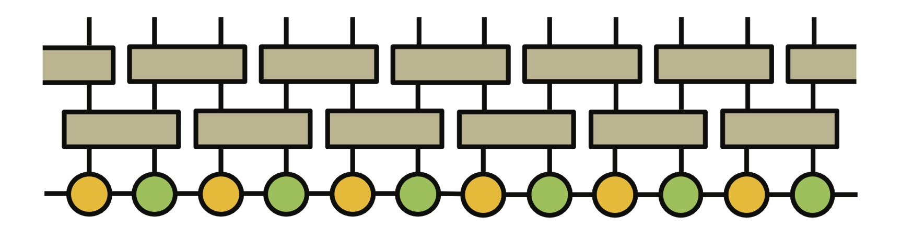
  <figcaption class="text-center mb-8">
    Time evolution with two-site gates
  </figcaption>
  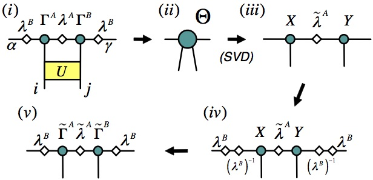
  <figcaption class="text-center mt-1">
    Contract and perform SVD truncation
  </figcaption>
</figure>

---

## TN algorithms: TRG & TNR (1)

- Tensor renormalization group (TRG)
  - Coarse-graining of 2D tensor network (partition function) until a single **fixed-point tensor**
  - Use SVD to split and recombine tensors

  <figure class="flex flex-col gap-10 items-center">
    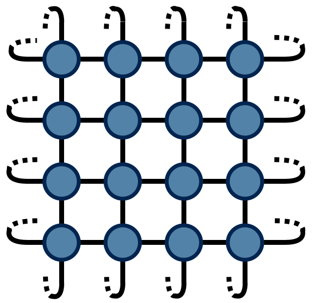
    <figcaption class="text-center">
      Partition function as a tensor network
    </figcaption>
  </figure>
  <figure class="flex flex-col gap-2 items-center w-96">
    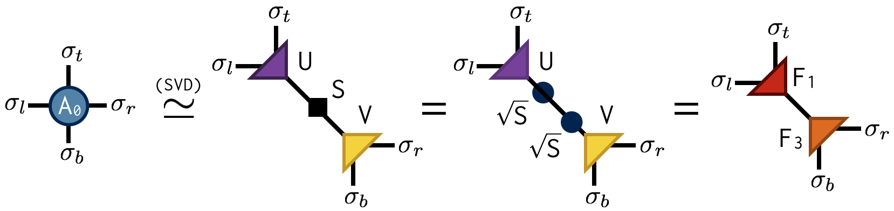
    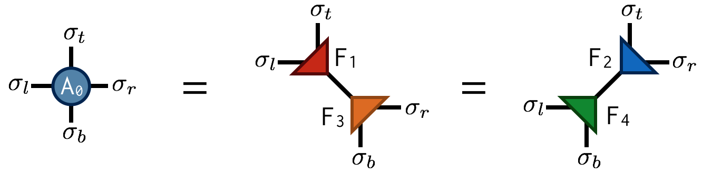
    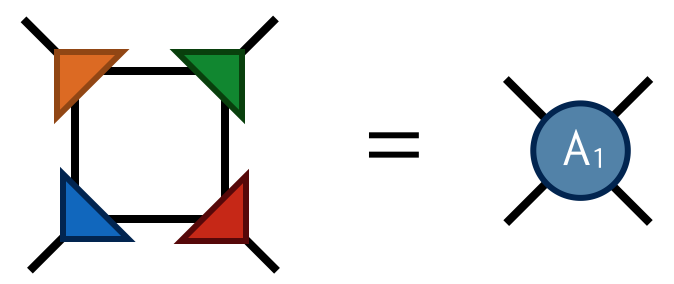
    <figcaption class="text-center mt-2">
      Decomposition and contraction in TRG
    </figcaption>
  </figure>

---
layout: two-cols
layoutClass: gap-16
---

## TN algorithms: TRG & TNR (2)

- TRG limitations:
  - Long-range entanglement in **critical systems**
    - Correlation length $\xi \to \infty$
    - Area-law violated with logarithmic \
      correction: $S_L \sim \log L$
  - Fails to properly renormalize at criticality

<figure class="flex flex-col gap-2 items-center w-120 mt-8">
  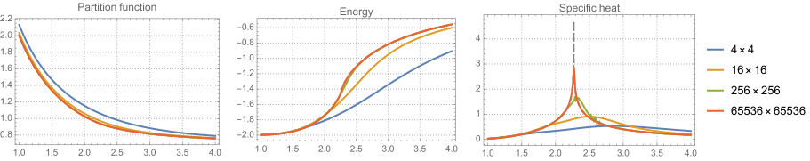
  <figcaption class="text-center">
    TRG simulation of 2D Ising model
  </figcaption>
</figure>

::right::

<h2>&nbsp;</h2>

- Tensor network renormalization (TNR)
  - **Isometry**: TRG triangle tensor
  - **Disentangler**: remove short-range entangle-\
    ment

<figure class="flex flex gap-8 items-center ml-24">
  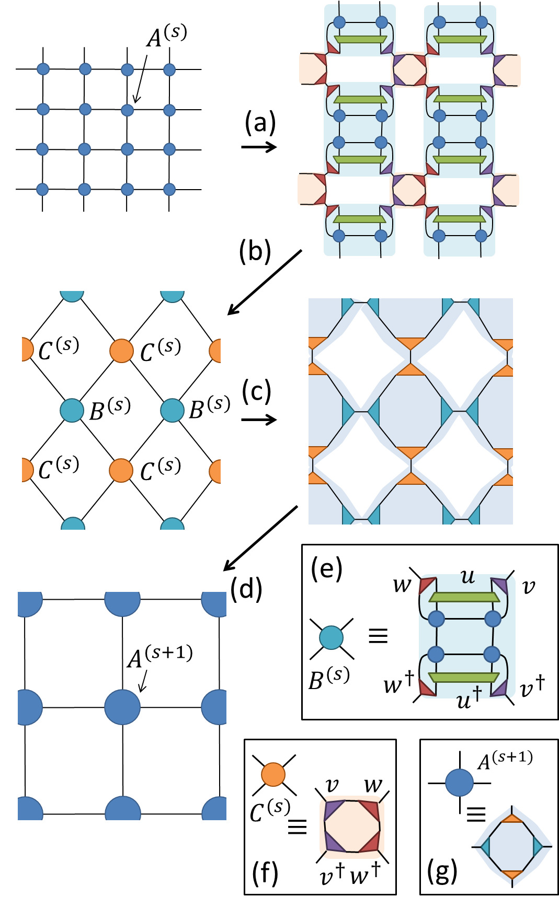
  <figcaption class="_text-center">
    TNR steps
     
    <i>u</i>: disentanglers
     
    <i>v</i>: isometries
  </figcaption>
</figure>

---
layout: two-cols
layoutClass: gap-16
---

## TN algorithms: MERA

- Multi-scale entanglement renormalization ansatz (MERA)
  - Variational ansatz for ground state wavefunction in \
    1D critical systems
  - Use isometries and disentanglers as in TNR
- Tensor network and AdS/CFT correspondence
  - Boundary: CFT (critical system)
  - Bulk: discrete AdS space (hyperbolic geometry) → gravity
  - Ryu--Takayanagi formula:
    - $S_A = \operatorname{Area}(\gamma_A)/4G_N$
    - Area law of entanglement entropy in CFT corresponds to \
      minimal surface in AdS

::right::

  <figure class="flex flex-col gap-2 items-center">
    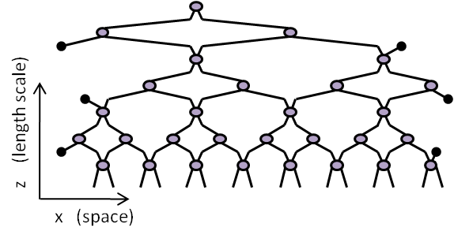
    <figcaption class="text-center">
      MERA tensor network
    </figcaption>
  </figure>
  <figure class="flex flex-col gap-2 items-center w-96">
    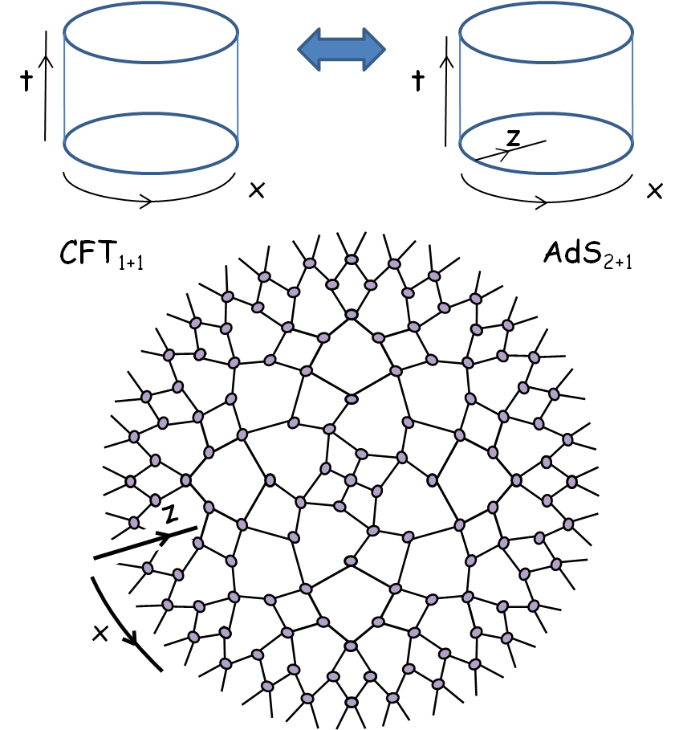
    <figcaption class="text-center mt-2">
      MERA in hyperbolic geometry → AdS/CFT
    </figcaption>
  </figure>

---

## References

- R. Orús. [Tensor networks for complex quantum systems](https://www.nature.com/articles/s42254-019-0086-7). *Nat. Rev. Phys.* <b>1</b>, 538--550 (2019)
- U. Schollwöck. [The density-matrix renormalization group](https://journals.aps.org/rmp/abstract/10.1103/RevModPhys.77.259). *Rev. Mod. Phys.* <b>77</b>, 259 (2005)
- G. Vidal. [Classical simulation of infinite-size quantum lattice systems in one spatial dimension](https://journals.aps.org/prl/abstract/10.1103/PhysRevLett.98.070201). \
  *Phys. Rev. Lett.* <b>98</b>, 070201 (2007)
- R. Orús and G. Vidal. [Infinite time-evolving block decimation algorithm beyond unitary evolution](https://journals.aps.org/prb/abstract/10.1103/PhysRevB.78.155117). \
  *Phys. Rev. B* <b>78</b>, 026117 (2008)
- M. Levin and C. P. Nave. [Tensor renormalization group approach to 2D classical lattice models](https://journals.aps.org/prl/abstract/10.1103/PhysRevLett.99.120601). \
  *Phys. Rev. Lett.* <b>99</b>, 120601 (2007)
- G. Evenbly and G. Vidal. [Tensor network renormalization](https://journals.aps.org/prl/abstract/10.1103/PhysRevLett.115.180405). *Phys. Rev. Lett.* <b>115</b>, 180405 (2015)
- G. Vidal. [Entanglement renormalization](https://journals.aps.org/prl/abstract/10.1103/PhysRevLett.99.220405). *Phys. Rev. Lett.* <b>99</b>, 220405 (2007)
- B. Swingle. [Entanglement renormalization and holography](https://journals.aps.org/prd/abstract/10.1103/PhysRevD.86.065007). *Phys. Rev. D* <b>86</b>, 065007 (2012)
- [Tensor Network](https://tensornetwork.org) and [tensors.net](https://www.tensors.net)
- And see my PhD thesis: [Aspects on tensor networks for topological orders](https://github.com/stone-zeng/phd-thesis)

